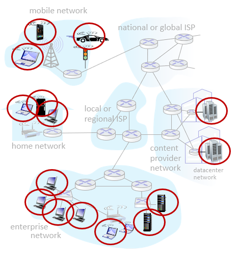
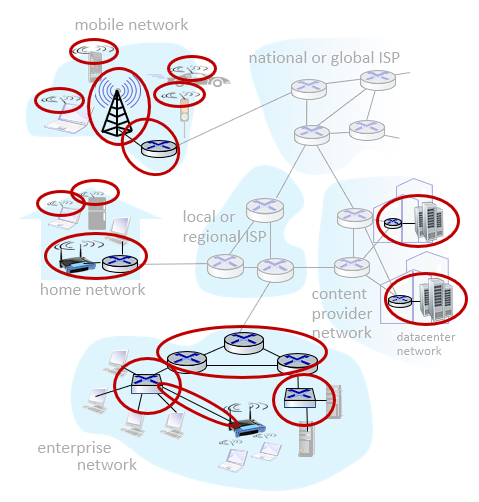
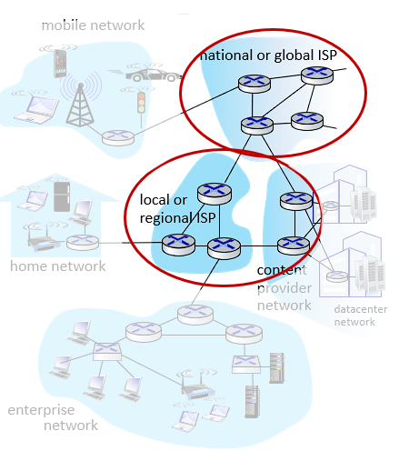

# 인터넷의 구조

- 인터넷은 네트워크들의 네트워크를 의미합니다.

- 네트워크는 서로 연결된 통신 링크들의 모음입니다.

## 네트워크의 가장자리 (Network Edge)

- 

- 네트워크의 가장자리는 우리 주변에서 접할 수 있는 종단 시스템(End System) 디바이스를 의미합니다.

## 접속 네트워크 (Access Network)

- 

- 네트워크의 가장자리에 있는 종단 시스템에서 인터넷에 연결하기 위해 직접 접근하는 네트워크입니다.

- 와이파이를 사용한다면 공유기를 예로 들 수 있고 셀룰러 네트워크를 사용한다면 기지국을 예로 들 수 있습니다.

- 그리고 접속 네트워크는 네트워크 코어(Network Core)의 라우터와 연결되어 있는 가장 가까운 라우터인 Edge Router와 연결되어 있습니다.

## 물리 매체 (Physical Media)

- 네트워크의 접속을 위해 물리적으로 연결된 매체를 의미합니다.

## 네트워크 코어

- 

- 로컬 ISP의 영역으로 서로 연결된 라우터들의 모음입니다.
