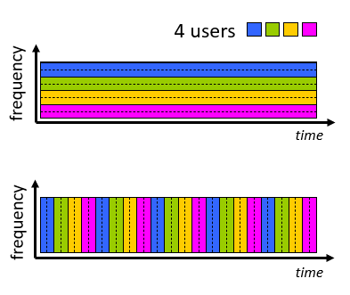

# 네트워크 코어 (Network Core)

- 네트워크 코어는 서로 연결된 라우터로 이루어져 있습니다.

## 네트워크 코어의 기능

- 네트워크 코어의 기능은 크게 두가지로 나눌 수 있습니다.

- 라우팅(Routing) - 데이터의 종단으로부터 다른 종단 까지의 루트를 정하는 기능입니다.

- 

- 포워딩(Forwarding) - 스위칭(Switching)이라고도 불리며 라우팅 알고리즘이 정한 루트대로 한 라우터가 자신과 연결된 라우터 중 어떤 라우터로 데이터를 전송할 지를 정하는 기능입니다. 스위칭에 대한 정보는 포워딩 테이블에 저장되어 있으며 포워딩 테이블은 라우팅 알고리즘에 의해 결정됩니다.

- 

## 패킷 스위칭 (Packet-switching)

- 호스트는 어플리케이션 계층 메세지를 패킷 단위로 나누어서 전송합니다.

- 패킷으로 이루어진 데이터는 네트워크를 통해 종착지까지 전송됩니다. 그 과정에서 라우터 to 라우터의 이동을 하는 동작을 패킷 스위칭이라고 합니다.

- 패킷 스위칭은 **_store-and forward_**방식으로 이루어집니다. 이 방식은 패킷이 라우터에 도달했을 때 패킷의 휘발을 방지하기 위해 저장한 후 전송하는 방식입니다.

- 패킷 전송 지연은 L/R로 L이 10Kbits이고 R이 100Mbps라면 패킷 하나 당 전송에 걸리는 시간은 0.1msec입니다.

### 큐잉 (Queueing)

- 라우터는 도달한 패킷을 Queue에 담긴 원소로서 처리합니다.

### 패킷 큐잉에서 발생 가능한 손실

- 

- 라우터에 패킷이 도달하는 속도가 패킷이 내보내지는 속도보다 빠른 경우 패킷의 손실이 발생할 수 있습니다.

- 패킷이 도달한 후 자신이 output link로 내보내지기 까지 시간이 오래 걸리면 패킷의 손실이 발생합니다.

- 그리고 라우터가 가진 버퍼나 메모리의 용량을 초과하는 경우에도 이후 들어오는 패킷의 손실이 발생합니다.

## 서킷 스위칭 (Circuit-switching)

- 서킷 스위칭 방식에서 종단과 종단을 연결하는 자원은 항상 해당 종단 시스템을 위해 할당되어 있습니다.

- 

- 어느 상황에서도 통신이 가능하다는 장점이 있지만 사용자들이 사용하지 않는 대부분의 시간에도 자원이 할당되어 있기 때문에 유연한 사용이 가능하지 않다는 단점이 있습니다.

## 주파수 다중 분할(Frequency Division Multiplexing), 시분할 다중화 (Time Division Multiplexing)

- FDM은 케이블로 연결된 유선 통신에서 해당 케이블 내의 영역을 주파수 대역폭으로 나눠서 각 영역을 사용자에게 할당하는 방식입니다.

- TDM은 케이블의 사용 시간을 시분할하여 각 시간 할당량 만큼 번갈아가면서 사용자에게 할당하는 방식입니다.

- 

## 패킷 스위칭 vs 서킷 스위칭

- 

- 위와 같은 서킷 스위칭으로는 10명의 사용자에게 서비스를 제공할 수 있습니다.

- 패킷 스위칭의 경우 10명의 사용자가 동시에 사용할 확률은 0.0004 미만이기 때문에 35명의 사용자에게 서비스를 제공할 수 있습니다.

## 패킷 스위칭 vs 서킷 스위칭 2

- 패킷 스위칭의 경우 `bursty`한 데이터에는 효과적이지만 패킷이 수용할 수 있는 한계 이상으로 몰리는 경우 패킷의 손실이 발생할 수 있습니다.

- 패킷 스위칭을 `circuit-like`하게 구현할 수 있다면 최적의 방법이 될 수 있습니다.
