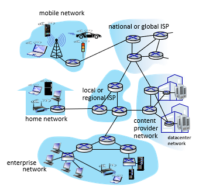
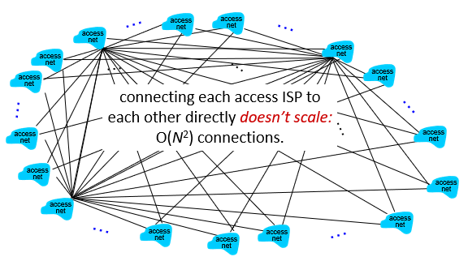
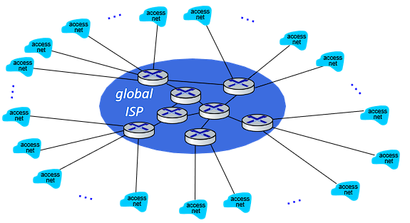
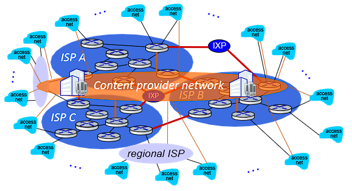
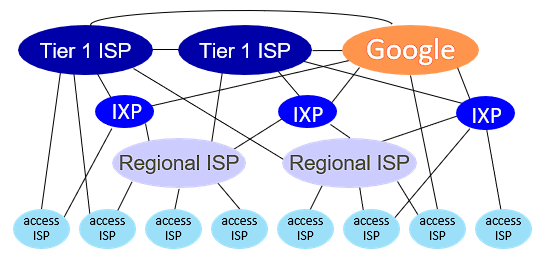

# 네트워크들의 네트워크

- 

- 호스트는 접속 ISP(Internet Service Provider)를 통해 인터넷에 접속합니다.

- 호스트 간 통신을 위해 ISP와 ISP는 서로 연결되어 있어야 합니다.

## ISP간의 연결

- 

- ISP와 ISP를 연결하기 위한 가장 단순한 방법은 모든 점을 선으로 연결하는 것입니다. 하지만 이 방법은 ISP간의 거리가 너무 멀고 인프라를 구축하기 위한 비용이 비현실적으로 높기에 실현할 수 없으며 모든 네트워크를 연결하는 데에 O(N^2)의 연결이 필요합니다.

- 

- 또 하나의 방법은 하나의 글로벌 ISP를 두고 ISP간 연결의 중간 지점 역할을 하는 방법입니다. 하지만 이 방법도 글로벌 ISP에 대한 소유의 문제로 현실적으로 불가능합니다.

- 

- 현재 ISP간 연결을 실현한 방법으로 지역 ISP가 각 지역에 존재하고 큰 ISP와 ISP 사이에 IXP라는 통신의 거점을 두고 연결되어 있으며 넷플릭스와 같은 전 세계에 많은 사용자를 둔 서비스의 경우 Content provider network라는 독자적인 네트워크를 사용해 사용자에게 데이터를 송신합니다.

- 

- 큰 ISP들을 Tier 1 ISP라고 하며 해당 ISP에 연결된 작은 지역 ISP들을 Tier 2 ISP라고 합니다.

- 국내 통신사들은 Tier 2 ISP이며 Tier 1 ISP에 망 사용료를 지불하고 국내에 서비스를 제공합니다.
