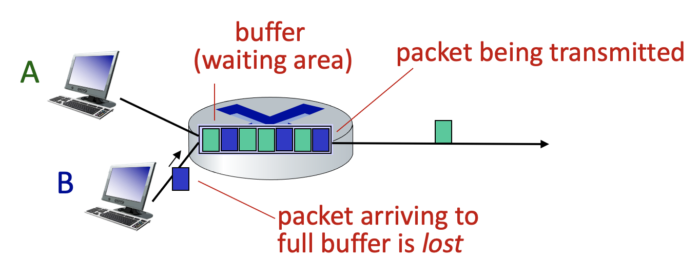

# 패킷 손실 (Pacekt loss)

- 

- 라우터에서 패킷의 큐잉이 이루어질때 큐잉할 수 있는 버퍼의 크기는 한정되어 있고 가득찬 이후 들어오는 패킷은 손실(loss)이 일어날 수 있습니다.

- 패킷의 손실이 일어난 경우의 해결책으로 패킷을 보낸 쪽 종단이 받는 쪽 종단으로부터 패킷을 전달받았다는 응답이 오지 않을 경우 재전송하는 방법이 있습니다.
