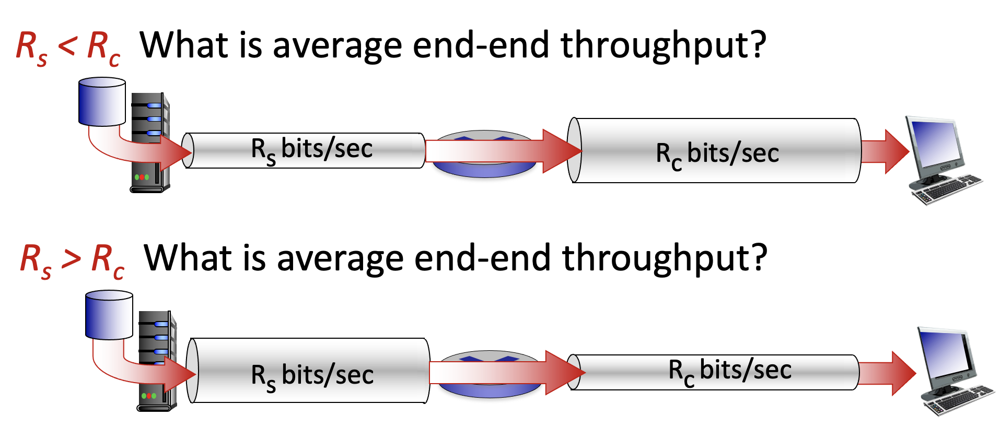
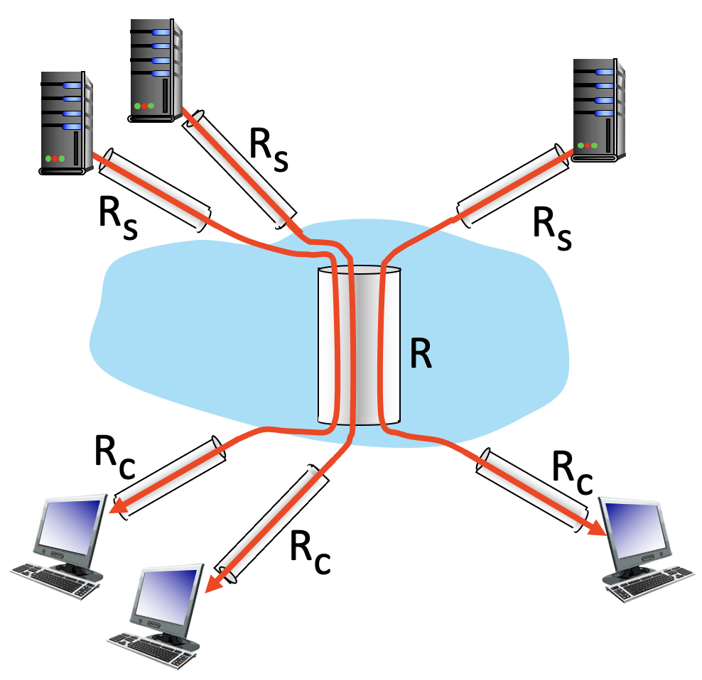

# 대역폭 (Throughput)

- 대역폭은 단위 시간당 전송 가능한 bit수의 비율을 의미합니다.

- 한 종단으로부터 다른 종단까지의 대역폭은 데이터가 거치는 모든 링크들 중 대역폭이 가장 작은 링크의 대역폭입니다.

- 그 이유는 한 링크가 높은 대역폭을 가지고 데이터를 전송하더라도 다음 링크가 낮은 대역폭을 가지고 있다면 결국 해당 링크에서 병목현상이 일어나고 전체 대역폭은 낮은 대역폭을 가진 링크에 맞게 될 수 밖에 없기 때문입니다.

- 

- 위 예시에서 위의 경우 대역폭은 Rs가 되고 아래의 경우 대역폭은 Rc가 됩니다.

- 

- 총 10개의 호스트가 연결된 위 예시에서 대역폭은 min(Rc, Rs, R/10)이 됩니다.
