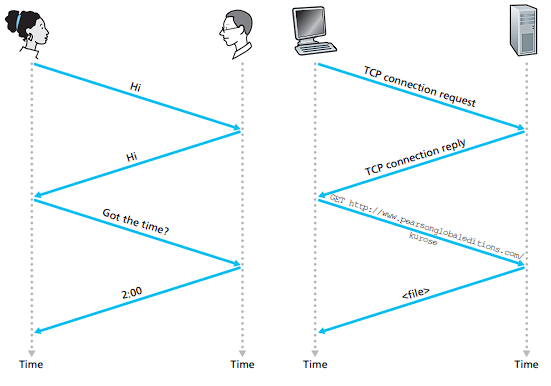

# 프로토콜

- 프로토콜은 컴퓨터와 컴퓨터가 서로 통신을 어떻게 할 지에 대한 약속을 의미합니다.

- 

- 위와 같이 사람과 사람의 대화에서 인사를 건내면 인사가 돌아오고 시간을 물으면 시간을 답하는 것 처럼 컴퓨터와 컴퓨터의 대화도 TCP 연결을 요청하면 TCP 연결을 응답하고 파일을 요청하면 요청된 파일을 응답합니다.

- 위와 같이 약속된 일련의 동작들을 프로토콜이라고 합니다.
