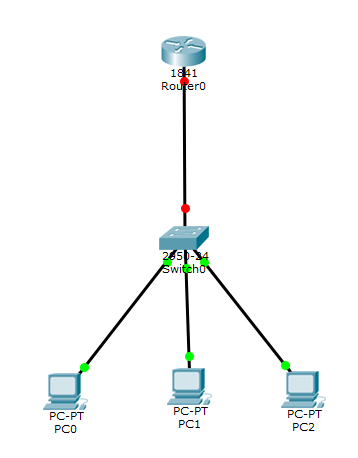

11/12 네트워크

## 클라우드의 정의

- 기업의 입장에서 클라우드는 사용자에게 제공하는 임대 서비스이다.

### SaaS (Software as a Service)

- 오피스365와 같이 Word와 같은 어플리케이션을 Web을 통해 사용할 수 있도록 제공하는 것도 소프트웨어 + 인프라스트럭처를 임대 서비스로 제공하는 것이다.

## Unicast

- 1:1 통신을 의미한다. 수신자와 송신자가 명확한 통신으로 볼 수 있다.

## Broadcast, Multicast

- 아파트 단지가 1~10동 까지 있다면 아파트 단지 전체에 방송하는 것을 Broadcast, 하나의 동에 방송하는 것을 Multicast로 볼 수 있다.

- 이것을 구분하는 이유는 이후 패킷을 분석할 때 사용할 수 있기 때문이다.

- 실제 클라우드 인프라에 비유하자면 하나의 서브넷에 복수의 인스턴스가 존재하고 해당 서브넷 대역의 모든 장치에 통신을 한다면 이것은 Broadcast이다.

## Network Interface Card

- NIC는 네트워크에 접속하는 데에 가장 기본적인 하드웨어이다.

## LAN card

- 랜카드는 물리적 주소인 MAC 주소를 가진 물리적 장치로 데이터의 입출력과 송수신, 프로토콜의 처리 기능 등을 담당한다.

## OSI 7 계층의 등장 배경

- 표준화를 목적으로 등장했다.

- 과거에는 이기종 장비간 통신이 되지 않았기 때문에 통신을 가능케 하기 위해서 ISO(국제 표준화 기구)에 의해 OSI 7 Layer가 고안되었다.

### 실무에서 가질 수 있는 OSI 7계층의 장점

- 이미 자동화 구축이 완료된 이후에는 문제가 발생했을 때 어떤 문제인지 정의하기가 어렵다. 네트워크를 7개 계층으로 추상화 한다면 문제점이 어느 계층에서 발생했는지 파악하고 문제를 정의하기 쉬워진다.

# OSI 7계층

## 물리 계층

- 0과 1로 이루어진 바이너리 데이터(bit)가 전달되는 계층으로 이 계층에서 데이터에 대한 분석은 없고 전달만 이루어진다.

## 데이터 링크 계층

- 최적의 경로를 위한 MAC 테이블을 생성하고 그 테이블을 기반으로 연결된 노드 간 통신을 담당한다.(포워딩)

- 데이터 링크 계층에서 전송되는 데이터의 단위는 프레임(Frame)이다.

- 프레임의 헤더 정보에는 MAC 주소가 있다.

### MAC 주소 vs IP 주소

|MAC 주소|IP 주소|
|-|-|
|물리적 주소|논리적 주소|
|실제 물리적으로 존재하는 주소이기 때문에 1회 부여된 이후 불변|장치의 주소를 추상화하여 논리적으로 부여한 것이므로 가변성이 있다.|
|Local Identification|Global Identification|
|라우터의 내부 망에서는 MAC 주소 테이블을 통해 내부 망에서만의 통신을 하기 때문에 Local ID로 볼 수 있다.|IP는 라우터 밖 외부 망의 장치들과 공인 IP를 통해 통신하므로 Global ID로 볼 수 있다.|

### 라우터 내부 망

- 

## 네트워크 계층

- 네트워크 간 최적의 경로를 결정한다.(라우팅)

- 패킷을 논리적인 주소인 IP 주소를 통해 전달한다.

- 패킷의 헤더 정보에는 IP 주소가 있다.

## 전송 계층

- 소프트웨어적인 특성을 가진 상위 3개 계층과 하드웨어적인 특성을 가진 하위 3개 계층 사이에서 중간적인 특성을 가진 계층이다.

- 프로세스간 통신을 위한 논리적 연결을 담당하고 End-to-End 데이터 통신을 보장한다.

- 데이터를 분할하고 재조립한다.(Message Segmentation) 이 계층에서 세그먼트에 시퀀스 넘버를 부여해서 나눈 후 송신하고 수신 측은 이 계층에서 세그먼트를 재조립하여 온전한 데이터를 받는다.

## 세션 계층

- 종단간 세션의 시작과 종료를 정의하는 계층이다.

- 사용자의 요청에 대한 State를 기억할 수 있도록 해주는 계층이다.

## 표현 계층

- 인코딩 <-> 디코딩, 암호화 <-> 복호화처럼 응용계층에서 만들어진 데이터를 컴퓨터가 이해할 수 있도록 변환(수신 측은 그 반대로)하는 계층이다.

## 응용 계층

- 사용자가 혹은 프로세스가 네트워크에 접근 가능하도록 해주는 계층이다.

- 프로세스간 통신 프로토콜이 다수 존재한다.

# TCP/IP

- TCP/IP는 OSI 7계층의 개념을 바탕으로 어떻게 프로그래밍하면 좋을 지를 기준 삼아 개발된 개념이다.

- IP는 그 자체로는 신뢰성이 없다. 패킷이 잘 전달되었는지 확인하고 재전송하는 기능이 없기 때문에 이 부분을 보완할 수 있는 TCP와 결합하고 이 TCP와 IP를 결합하여 사용하는 네트워크의 개념을 추상화한 것이 TCP/IP이다.

## L2 프로토콜

- 데이터 링크 계층의 프로토콜로 네트워크를 구성하는 방식의 결정을 의미한다

- 이더넷이 주로 쓰이며 Token ring, FDDI 등의 방식이 있다.

### 이더넷 (Ethernet)

- 데이터를 전송할때 CSMA/CD(Carrier Sense Multiple Access/Collision Detection) 방식을 사용한다.

- CSMA/CD 방식은 전송하려는 케이블에 다른 프레임이 전송되는지 신호를 감지하고 충돌 발생 여부를 확인한 다음 안전할 때 데이터를 전송한다.

### 주소 결정 프로토콜

- ARP는 논리적 주소를 물리적 주소로 변환하고 RARP는 물리적 주소를 논리적 주소로 변환한다.

## L4 프로토콜

- TCP는 연결지향형 프로토콜로 신뢰성있게 데이터를 전송할 수 있게 해준다.

- L7에서의 프로토콜은 양 호스트의 식별이 전제되어야 한다.

- 이것을 추상화 하는데에 TCP/IP가 필요하다고 볼 수 있다.

11/13 네트워크

